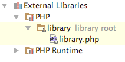

# phpstorm-library-plugin

The repository is intended to demonstrate how to use a new "libraryRoot" API of PhpStorm. It consists of two parts:

1. `plugin.xml` which contains a simple extension point implementation:

    <extensions defaultExtensionNs="com.jetbrains.php">
        <libraryRoot id="library" path="/library/" runtime="false"/>
    </extensions>

2. `library` directory with PHP-files.

To turn these files into a plugin you need to simply zip content of the `plugin` directory:

    zip -r phpstorm-library-plugin.jar *

If you install the plugin into PhpStorm you'll find PHP-files attached as an external library.

Note: when you implement your own plugin don't forget to change the directory name from `library`
to an appropriate unique name e.g. `CodeIgniter`.